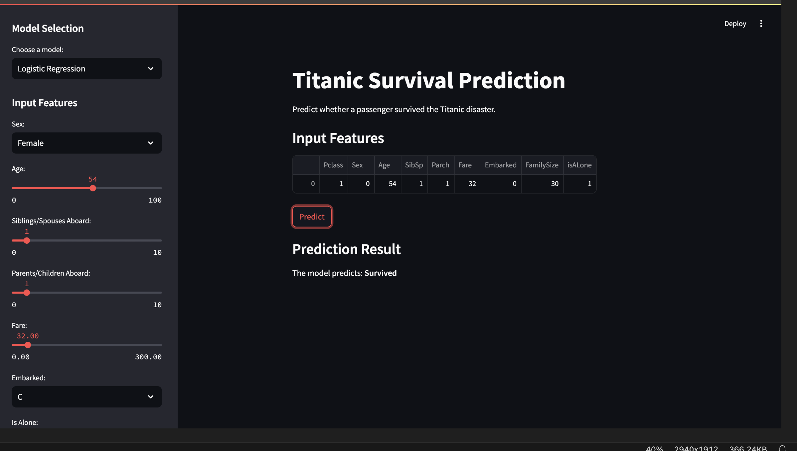

# Titanic Dataset Analysis and Deployment
## Overview

This project involves analyzing the Titanic dataset to predict survival rates using machine learning models. The dataset provides information about the passengers aboard the Titanic, including their demographics, socio-economic status, and other features that can influence survival outcomes. The project explores feature engineering, model building, evaluation, and deployment to showcase end-to-end machine learning capabilities.

# Business and Data Understanding
## Business Problem
The objective is to build a predictive model to determine the likelihood of a passenger surviving the Titanic disaster. This model can serve as a prototype for decision-making processes where survival probabilities are crucial.

## Dataset Description
The dataset includes the following key features:

PassengerId: Unique identifier for each passenger.

Pclass: Passenger class (1st, 2nd, or 3rd class).

Name: Passenger's name.

Sex: Gender of the passenger.

Age: Age of the passenger.

SibSp: Number of siblings or spouses aboard.

Parch: Number of parents or children aboard.

Ticket: Ticket number.

Fare: Ticket fare.

Cabin: Cabin number.

Embarked: Port of embarkation (C = Cherbourg, Q = Queenstown, S = Southampton).

Survived: Target variable (0 = Did not survive, 1 = Survived).

# Modeling
## Feature Engineering
Encoding categorical variables (e.g., Sex and Embarked).

Creating new features (e.g., family size, IsAlone for individuals travelling alone).

## Machine Learning Models
The following models were implemented and evaluated:

Logistic Regression

Decision Trees

Random Forest

## Model Evaluation
Models were evaluated using metrics such as:

Accuracy

Precision

Recall

F1-Score

ROC-AUC

## Deployment
This project includes deploying the best-performing model as a web application for user interaction.

## Tools Used*
streamlit: A lightweight web framework for Python.

## Deployment Steps
Train and Save the Model:

Train the best-performing model and save it using Python's joblib

# Deployment Demonstration

# Conclusion
The Titanic dataset project demonstrates the full vycle of machine learning, from data preprocessing and model building to deployment. The deployed application allows users to input passenger details and receive survival predictions, showcasing how machine learning can solve real-world problems.

